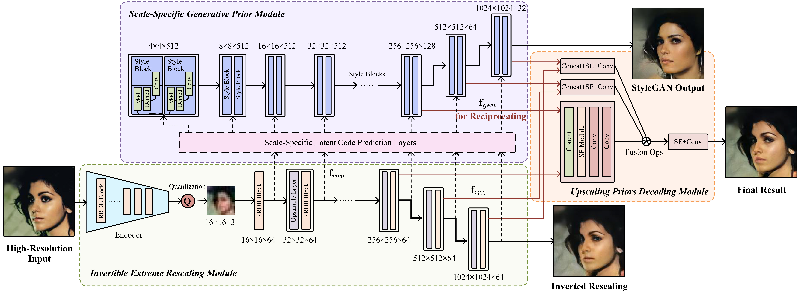

# Faithful Extreme Rescaling via Generative Prior Reciprocated Invertible Representations

[Paper](https://openaccess.thecvf.com/content/CVPR2022/papers/Zhong_Faithful_Extreme_Rescaling_via_Generative_Prior_Reciprocated_Invertible_Representations_CVPR_2022_paper.pdf) | [Supplementary](https://openaccess.thecvf.com/content/CVPR2022/supplemental/Zhong_Faithful_Extreme_Rescaling_CVPR_2022_supplemental.pdf)

>This paper presents a Generative prior ReciprocAted Invertible rescaling Network (GRAIN) for generating faithful high-resolution (HR) images from low-resolution (LR) invertible images with an extreme upscaling factor (64x). Previous researches have leveraged the prior knowledge of a pretrained GAN model to generate high-quality upscaling results. However, they fail to produce pixel-accurate results due to the highly ambiguous extreme mapping process. We remedy this problem by introducing a reciprocated invertible image rescaling process, in which high-resolution information can be delicately embedded into an invertible low-resolution image and generative prior for a faithful HR reconstruction. In particular, the invertible LR features not only carry significant HR semantics, but also are trained to predict scale-specific latent codes, yielding a preferable utilization of generative features. On the other hand, the enhanced generative prior is re-injected to the rescaling process, compensating the lost details of the invertible rescaling. Our reciprocal mechanism perfectly integrates the advantages of invertible encoding and generative prior, leading to the first feasible extreme rescaling solution. Extensive experiments demonstrate superior performance against state-of-the-art upscaling methods.


<br>
Overview of the GRAIN framework. GRAIN is composed of three modules, invertible extreme rescaling module, scale-specific generative prior module and upscaling priors decoding module. With a pre-trained StyleGAN capturing the image prior, the invertible encoder-decoder and reciprocal design learns both recovery and naturalness of images.


## Description
This is the official implementation of our CVPR 2022 (Oral) paper "Faithful Extreme Rescaling via Generative Prior Reciprocated Invertible Representations".

## Pretrained Models
Please download the pre-trained models from the following links.
| Path | Description
| :--- | :----------
|[FFHQ StyleGAN2](https://drive.google.com/file/d/1pNNcznoqPYmndMpkkqgWde3D08Ea8Z-V/view?usp=sharing) | StyleGAN2 model pretrained on FFHQ taken from [rosinality](https://github.com/rosinality/stylegan2-pytorch) with 1024x1024 output resolution.
|[FFHQ StyleGAN2 Discriminator](https://drive.google.com/file/d/16tgrQol12gxoDi48cRB1Snz-ka4fx2qr/view?usp=sharing) | Pretrained StyleGAN2 discriminator model on FFHQ taken from [rosinality](https://github.com/rosinality/stylegan2-pytorch) for use in our adversarial loss during training.
|[IR-SE50 Model](https://drive.google.com/file/d/13Z-dRr74z_9haqZy9N7bRSeJF6StC-r_/view?usp=sharing) | Pretrained IR-SE50 model taken from [TreB1eN](https://github.com/TreB1eN/InsightFace_Pytorch) for use in our ID loss during training.
|[invRRDB](https://drive.google.com/file/d/187JyB4KowYPUTYZHkcB6mhux4Jejm72-/view?usp=sharing) | Pretrained model of our Invertible Extreme Rescaling Module on CelebA-HQ dataset.
|[codeStyleGAN](https://drive.google.com/file/d/1filbDDAB-h0bGZL2EOnq_930_ukYzVkC/view?usp=sharing) | Pretrained model of our Scale-Specific Generative Prior Module on CelebA-HQ dataset.
|[Fusion](https://drive.google.com/file/d/1wawGRWW8O3XA04qauJPLopa2uVoEFdqR/view?usp=sharing) | Pretrained model of our Upscaling Priors Decoding Module on CelebA-HQ dataset.

The pretrained models should be saved to the directory `pretrained_models`.

## Prepareing data
Please go to `configs/paths_config.py` and define:
``` 
dataset_paths = {
    'celeba_train': '/path/to/celeba-hq-standard-train'
    'celeba_test': '/path/to/celeba-hq-standard-test',
}
```

## Training
We adopt a multi-stage strategy to stabilize the training of GRAIN. We first train the Invertible Extreme Rescaling Module in Stage 1. After that we utilize the pretrained Invertible Extreme Rescaling Module model to train the Scale-Specific Generative Prior Module in Stage 2. And then both these two pretrained models are used to train the Upscaling Priors Decoding Module in Stage 3. Finally, we finetuen the whole model based on all pretrained models in Stage 4.

#### Stage 1
Train the Invertible Extreme Rescaling Module.
```
python train.py --invRRDB --exp_dir=/path/to/experiment --lr_l2_lambda=0.1 
```

#### Stage 2
Train the Scale-Specific Generative Prior Module.
```
python train.py --codeStyleGAN --exp_dir=/path/to/experiment --InvRRDB_checkpoint_path=/path/to/invRRDB_model.pt  
```

#### Stage 3
Train the Upscaling Priors Decoding Module.
```
python train.py --Fusion --exp_dir=/path/to/experiment --InvRRDB_checkpoint_path=/path/to/invRRDB_model.pt --CodeStyleGAN_checkpoint_path=/path/to/codeStyleGAN_model.pt
```

#### Stage 4
Finetune the whole model.
```
python train.py --finetune --exp_dir=/path/to/experiment --lr_l2_lambda=0.1 --InvRRDB_checkpoint_path=/path/to/invRRDB_model.pt --CodeStyleGAN_checkpoint_path=/path/to/codeStyleGAN_model.pt --feaFusion_checkpoint_path=/path/to/Fusion_model.pt
```

####

$\color{#FF0000}{Note:}$ 
1. You should determine training iterations by yourself using `--max_steps` (the default value 300000 is only a suggestion).
2. You could modify the `--lr_l2_lambda` for better balancing the LR and HR result quality.

## Testing
```
python test.py --exp_dir=/path/to/results
```
We assume that all pretrained models are downloaded and saved to the directory `pretrained_models`.

## Acknowledgments
We borrow some codes from [pSp](https://github.com/eladrich/pixel2style2pixel).

## Citation
```
@inproceedings{zhong2022faithful,
  title={Faithful extreme rescaling via generative prior reciprocated invertible representations},
  author={Zhong, Zhixuan and Chai, Liangyu and Zhou, Yang and Deng, Bailin and Pan, Jia and He, Shengfeng},
  booktitle={Proceedings of the IEEE/CVF Conference on Computer Vision and Pattern Recognition},
  pages={5708--5717},
  year={2022}
}
```
